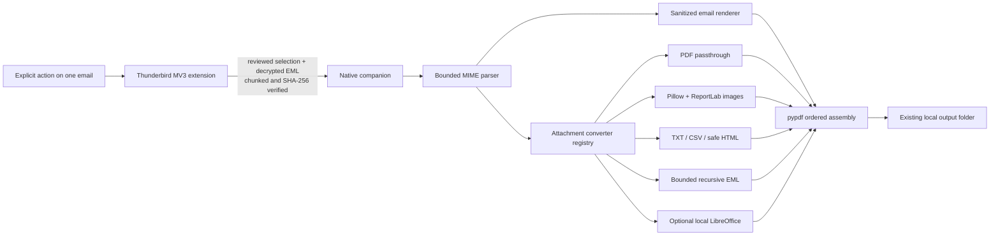

# Architecture

## Slice 2 decision

The extension owns Thunderbird API access and the review UI. The native process
owns filesystem access, EML parsing, conversion, PDF assembly, and Windows
dialogs. No Experiment API, download workaround, cloud converter, mailbox
scanner, or Paperless client is used.

`messages.listAttachments()` supplies the review display. Thunderbird 135+
provides `contentDisposition`; Thunderbird 128 provides `contentId` for related
inline parts. The extension uses the disposition when present and the content ID
fallback on 128, then assigns zero-based ordinals only to real attachments. The
verified raw EML remains authoritative: the native MIME parser independently
reconstructs the real-attachment order and rejects the job if the reviewed count
no longer matches.

The native registry classifies by a reviewed MIME/extension allowlist. All
supported real attachments are selected by default. The host revalidates each
selection and creates explicit include/skip decisions before rendering the
first section. A selected conversion failure aborts the job; an unsupported or
unselected item remains named in the email section and final result.

`PdfSection` forms a tree. The assembler writes the email first, then top-level
attachments in MIME order. A nested EML section contains its recursively
converted children. pypdf appends source pages without rasterizing PDFs,
preserves each page's geometry, creates matching outlines, removes active page
actions and non-URI annotations, normalizes safe external link annotations, and
writes normalized document metadata. Separator pages
are an optional persisted setting and default to off.

## Compatibility choices

- Manifest V3, a fixed add-on ID, and `strict_min_version` 128.0.
- `MessageAttachment.contentDisposition` is optional at runtime because it was
  added after Thunderbird 128; the 128-compatible `contentId` fallback remains
  covered by extension tests.
- `messageDisplay.getDisplayedMessages()` uses the MV3 `MessageList.messages`
  shape; a context-menu message ID is resolved with `messages.get()`.
- `messages.getRaw(id, {data_format: "File", decrypt: true})` prevents JavaScript
  from reconstructing headers or MIME payloads.
- A long-lived `runtime.connectNative()` port supports bounded chunks,
  progress, cancellation, capabilities, and a final result.
- Thunderbird exposes no arbitrary local-directory picker to this extension;
  the companion therefore owns folder selection and opening.
- LibreOffice support is capability-gated. When absent, Office/ODF formats are
  disabled before transfer; the remaining converters do not depend on it.

Primary references:

- [Thunderbird messages API](https://webextension-api.thunderbird.net/en/mv3/messages.html)
- [Thunderbird Manifest V3 guidance](https://developer.thunderbird.net/add-ons/mailextensions/manifest-v3)
- [MDN Native Messaging](https://developer.mozilla.org/en-US/docs/Mozilla/Add-ons/WebExtensions/Native_messaging)
- [pypdf outlines](https://pypdf.readthedocs.io/en/stable/user/handling-outlines.html)
- [pypdf PdfWriter](https://pypdf.readthedocs.io/en/stable/modules/PdfWriter.html)
- [Pillow EXIF orientation](https://pillow.readthedocs.io/en/stable/reference/ImageOps.html)
- [LibreOffice command-line conversion](https://help.libreoffice.org/latest/en-US/text/shared/guide/convertfilters.html)
